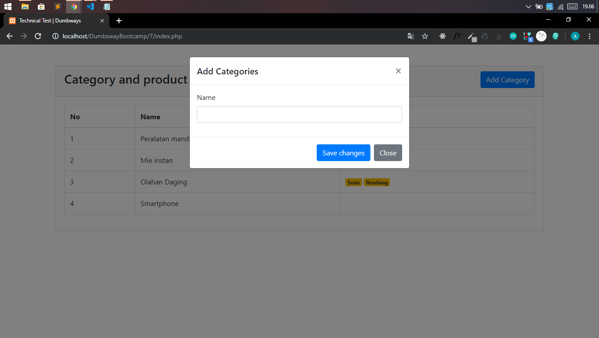

# dumbWays-test
jawaban dari test bootcamp
### 1.untuk soal nomer 1 - 5 saya menggunakan bahasa pemrograman javascript untuk menjalankan dengan menggunakan perintah node namafile.js
### 2.untuk soal nomer 7 saya menggunakan bahasa pemrograman php untuk menjalankannya,pastikan sudah terinstal xampp,setelah itu import database.nya
### terlebih dahulu yang berada di folder 6/a.sql setelah itu buka browser ketikan http://localhost/nama_folder 

# Screenshot

